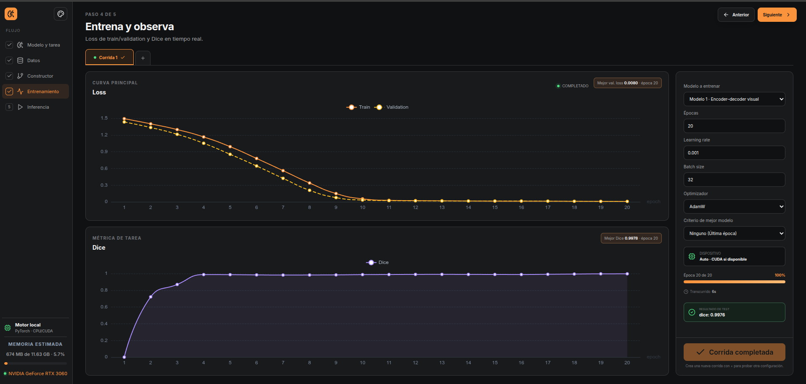
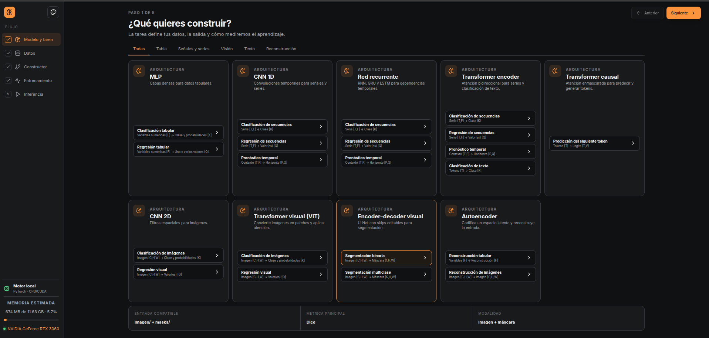
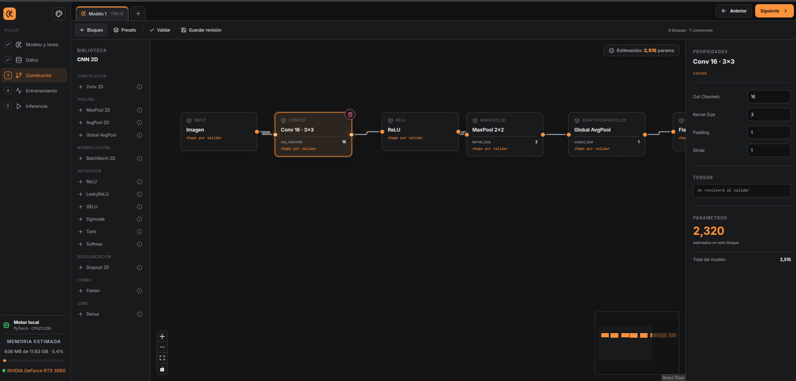

# ModelBuilder

Aplicación visual local para crear proyectos, elegir una tarea compatible, preparar datos, construir una red mediante bloques, entrenarla con PyTorch y ejecutar inferencia desde un checkpoint.

La base usa **React + TypeScript + React Flow + ECharts**, un shell **Tauri 2** y un motor local **Python/PyTorch**. El catálogo cubre MLP, CNN 1D/2D (incluyendo un preset con bloque residual editable), RNN/GRU/LSTM, Transformer encoder, Transformer causal, ViT, U-Net y autoencoders.



## Funciones implementadas

- Biblioteca y creación de proyectos con recuperación del estado de edición.
- Selector por Tabla, Señales y series, Visión, Texto y Reconstrucción; una tarea puede ofrecer varias arquitecturas compatibles.
- Trece tareas: clasificación, regresión, pronóstico, segmentación, reconstrucción y modelado de tokens.
- Datos sintéticos reales por tarea e importación de CSV, secuencias, corpus TXT/TSV, carpetas de imágenes, `labels.csv` y pares `images/` + `masks/`.
- Particiones train/validation/test editables arrastrando sus dos límites; el reparto elegido se persiste y se aplica al entrenamiento real.
- Constructor drag-and-drop con puertos, conexiones, biblioteca por arquitectura, edición de propiedades e inspector derecho.
- Compilación topológica del canvas a módulos PyTorch. Las ramas U-Net/ResNet y `Concat`/`Add` se ejecutan según las conexiones dibujadas.
- Bloques reales de Conv1D, pooling 1D, padding causal, RNN, GRU, LSTM, embedding, posición, atención encoder/causal, pooling de tokens y patch embedding de ViT.
- Validación de ciclos, nodos desconectados, shapes de salida y dry-run real.
- Entrenamiento PyTorch en un proceso separado, con loss train/validation, métrica de tarea, checkpoint `best`/`last` y evaluación test final.
- Inferencia desde el checkpoint guardado y el mismo contrato de datos.
- Tema oscuro de gris neutro inspirado en `references/`, tema claro y cuatro acentos persistentes: azul, naranja, verde y violeta.

VAE y Transformer encoder–decoder permanecen deliberadamente fuera del catálogo disponible: requieren salidas múltiples/pérdida KL y cross-attention/generación respectivamente. No se muestran como funciones parciales. El estado detallado está en [`ARCHITECTURE_TODO.md`](ARCHITECTURE_TODO.md).





### Datos de texto

La app puede generar un corpus sintético para verificar el flujo completo sin red. Para datos reales acepta archivos locales: `label<TAB>texto` en clasificación y una muestra por línea en modelado causal. Los datasets públicos pueden descargarse fuera de la app y luego importarse; todavía no se ejecutan descargas automáticas ni código remoto.

## Instalación de dependencias

Frontend:

```bash
npm install
```

Backend (Python >= 3.11):

```bash
pip install -e .
```

## Ejecutar la interfaz web de desarrollo

```bash
./run-web.sh
```

Abrir `http://127.0.0.1:1420`. Este modo ejecuta el motor Python/PyTorch real a través del proxy de Vite, por lo que generación de datos, entrenamiento, métricas en vivo e inferencia funcionan. Lo que no está disponible en web es la gestión persistente de proyectos en disco (`project.create/open/delete`) y el selector nativo de carpetas; esas operaciones requieren el shell Tauri.

## Ejecutar como aplicación Tauri en Linux

Tauri necesita las cabeceras nativas de WebKitGTK/GLib. En Ubuntu, Zorin OS o derivados:

```bash
./scripts/install-linux-deps.sh
./run.sh
```

## Validación

```bash
npm run build
pytest
python3 backend/modelbuilder/engine.py <<<'{"action":"hello"}'
```

La suite incluye las rutas originales y pruebas adicionales de forward/backward para cada familia nueva, generación de datasets nuevos y un recorrido real entrenamiento→checkpoint→inferencia de texto.

## Estructura

```text
frontend/           React, canvas y pantallas
backend/            motor Python/PyTorch
src-tauri/          shell y puente de procesos
tests/              validación del motor y recorridos
docs/               especificación de producto y arquitectura
references/         referencias visuales conservadas
workspace_data/     proyectos generados localmente en ejecución (ignorado por Git)
```

La especificación completa comienza en [docs/01-producto-y-alcance.md](docs/01-producto-y-alcance.md). El plan y sus criterios están en [docs/07-plan-y-aceptacion.md](docs/07-plan-y-aceptacion.md).
