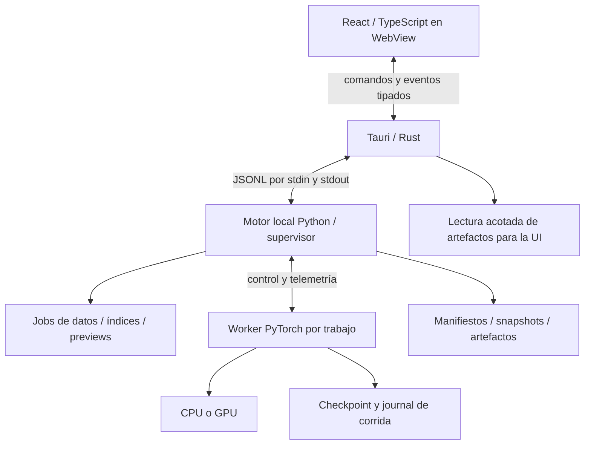

# 06 · Arquitectura técnica y distribución

**Estado actualizado:** scaffold React/Tauri/Python, protocolo por pipes, persistencia y motor PyTorch implementados. El empaquetado Tauri en este Linux necesita instalar las cabeceras WebKitGTK/GLib indicadas en el README.

## 1. Stack y responsabilidad

| Capa | Tecnología propuesta | Responsabilidad |
| --- | --- | --- |
| UI | React + TypeScript + Vite | Pantallas, navegación, estado de edición y componentes |
| Estilo | CSS con tokens y componentes accesibles reutilizables | Temas, layout, foco, densidad y consistencia |
| Canvas | React Flow (`@xyflow/react`) | Nodos/puertos/aristas, selección y viewport |
| Auto-layout | ELK.js, inicialmente como candidato a validar | Posiciones de grafos con ramas; ejecución fuera del hilo principal si es costosa |
| Gráficas | Apache ECharts | Loss, métricas, dispersión, matrices y zoom |
| Escritorio | Tauri 2 + Rust | Ventana, diálogos, recursos locales y supervisión de procesos |
| Backend | Python + PyTorch | Dominio, datos, compilación del grafo, entrenamiento e inferencia |
| Contratos | JSON Schema + modelos Python y tipos TS generados | Protocolo/versiones/esquemas de bloques y artefactos |
| Persistencia | Manifiestos JSON, logs JSONL, archivos de pesos y datos indexados | Proyectos portátiles, snapshots y recuperación |
| Paquete Python | PyInstaller como primera opción a probar | Runtime local y dependencias, separado de la UI |

ECharts ofrece series, heatmaps y herramientas interactivas de zoom/tooltips; usaremos sólo los componentes necesarios y validaremos su coste en el WebView real. Véase [funcionalidades oficiales](https://echarts.apache.org/en/feature.html). Elegir una biblioteca no sustituye medir accesibilidad ni rendimiento del producto.

No se exige Next.js, SSR, servidor remoto ni cuenta del usuario. Un navegador puede alojar la UI durante desarrollo con un adapter de pruebas, pero la distribución primaria es de escritorio. El backend sigue siendo Python aunque Tauri añada una capa pequeña en Rust.

## 2. Procesos



Tauri inicia un sidecar Python conocido, verifica handshake y lo supervisa. El motor atiende comandos sin ejecutar un train loop dentro del lector del protocolo. Operaciones largas como importación, dry-run, entrenamiento e inferencia usan jobs cancelables.

Worker usa `spawn` o un subproceso explícito portable, sin asumir fork ni heredar un contexto CUDA. Una cola administra el dispositivo; A limita a un trabajo pesado por dispositivo y conserva responsividad. DataLoader workers pertenecen al worker y se cierran con él.

El motor carga registros ligeros al arrancar; la carga de PyTorch/dispositivos puede ser asíncrona y mostrar «Preparando motor». No marcar GPU disponible antes de detectar runtime y driver. Fallar una corrida no cierra toda la UI.

## 3. Transporte decidido para la primera versión

**Comandos UI→Tauri→Python y eventos de vuelta mediante JSON por líneas sobre pipes locales.** No abrir puertos HTTP como requisito de A. Esta decisión concreta el transporte que quedó abierto en la nota de stack anterior.

UTF-8; una línea completa por mensaje; `stdout` sólo protocolo, `stderr` para logs técnicos. Rust reensambla chunks de bytes y conserva caracteres UTF-8 que crucen lecturas. Flush en respuestas/eventos. Límite inicial propuesto de 1 MiB por mensaje; grafos o contenidos mayores usan un artefacto referenciado.

Imágenes, tensores, datasets y checkpoints no circulan como grandes cadenas base64. El motor publica un `artifact_id`, tipo, dimensiones y checksum; Tauri lo resuelve dentro de ubicaciones autorizadas y expone lectura local acotada a la UI. No aceptar rutas arbitrarias enviadas por contenido del canvas.

El adapter de comunicación se mantiene independiente para permitir HTTP/WebSocket en una futura edición remota. No implementar ambos transportes antes de necesitarlos.

## 4. Envelope y semántica de mensajes

Comando ilustrativo:

```json
{
  "protocol_version": 1,
  "kind": "request",
  "request_id": "req-42",
  "method": "graph.validate",
  "project_id": "project-1",
  "experiment_id": "experiment-1",
  "expected_revision": 7,
  "payload": {"graph_revision": 7, "dataset_revision": 3}
}
```

Respuesta con `request_id`, `ok`, resultado o error estructurado. Error contiene `code`, `message`, `details`, `recoverable` y referencia de campo/nodo si aplica. No serializar NaN/Infinity como JSON inválido: usar null + estado/razón explícita.

Evento ilustrativo:

```json
{
  "protocol_version": 1,
  "kind": "event",
  "event": "run.metrics",
  "event_id": "run-1:128",
  "run_id": "run-1",
  "seq": 128,
  "timestamp": "2026-09-05T20:00:00Z",
  "payload": {
    "phase": "validation",
    "epoch": 3,
    "optimizer_step": 96,
    "metrics": {"loss": 0.41, "accuracy": 0.84},
    "aggregation": "epoch",
    "count": 150
  }
}
```

Handshake: versión de protocolo, versión app/backend, versiones de esquemas, catálogo de bloques/tareas y capacidades de dispositivo. Un desacuerdo incompatible bloquea acciones con explicación; no intentar interpretar datos con otra versión silenciosamente.

Comandos largos devuelven aceptación y `job_id`/`run_id`; la terminación llega como evento. Timeout del request no significa que el trabajo no haya empezado. `run.start`, importación y creación incluyen clave de idempotencia persistida: reintentar tras desconexión consulta la misma operación, no duplica el trabajo.

`expected_revision` evita guardar sobre cambios nuevos. Validación asíncrona devuelve revisión; el frontend descarta resultados viejos. Eventos durables tienen secuencia monótona por run; la UI deduplica por run+seq. Tras reconnect consulta snapshot y recupera eventos desde cursor, luego sigue en vivo. Progreso efímero puede consolidarse; estados terminales y checkpoints nunca se pierden por backpressure.

## 5. API de aplicación propuesta

| Grupo | Operaciones mínimas | Resultado |
| --- | --- | --- |
| Motor | `hello`, `capabilities`, `health`, `shutdown` | Estado y capacidades reales |
| Proyectos | `project.create/open/save/list_recent`, `experiment.create/duplicate/select` | Manifiesto y revisión |
| Catálogos | `catalog.tasks`, `catalog.blocks`, `catalog.templates` | Esquemas/versiones y disponibilidad |
| Datos | `data.inspect/import/generate/preview/configure/split/commit/relink` | Job, diagnóstico o revisión de dataset |
| Grafo | `graph.save/validate/dry_run`, `graph.template.save` | Snapshot/errores/shapes/coste |
| Recursos | `resources.estimate/status` | Estimado separado de medido |
| Corridas | `run.start/pause/resume/cancel/status/list/events` | Acuse, estado, historial |
| Checkpoints | `checkpoint.list/inspect/export` | Contrato, integridad y artefactos |
| Evaluación | `evaluation.start/status/export` | Métricas ligadas a checkpoint/split |
| Inferencia | `inference.start/cancel/status/history/export` | Trabajo y resultados |
| Artefactos | `artifact.describe/read` | Metadata y contenido acotado |

Diálogos de selección se gestionan por Tauri, que entrega referencias aprobadas al motor. El motor confirma validez de archivo, esquema y pertenencia al proyecto. No aceptar comandos shell construidos con nombres de archivos del usuario.

## 6. Dominio desacoplado

`TaskSpec`: modalidad, input/target, familias compatibles, salida, losses, métricas, postprocesador y UI de resultados. `BlockSpec`: contrato de [04](04-constructor-y-bloques.md). `DatasetAdapter`: inspección/importación/indexado/preview y schema. `TrainingRecipe`: batches, forward, loss, métricas, evaluación y checkpoint. `InferenceAdapter`: preparación, ejecución y postproceso.

Para añadir una familia se requiere registro + bloques faltantes + plantillas + compatibilidad + generador/importador + receta + inferencia + pruebas. No editar un gran condicional repartido por cinco pantallas. Frontend usa esquemas para propiedades comunes y componentes especializados para previews que lo necesitan.

JSON Schema es el contrato publicado versionado. Los tipos TS se generan y el backend valida en runtime; no mantener manualmente dos catálogos distintos. Las reglas numéricas profundas permanecen en Python; TS sólo realiza prechecks rápidos y renderiza diagnóstico autoritativo.

## 7. Persistencia del proyecto nuevo

Estructura propuesta, todavía no creada:

```text
mi-proyecto/
├── project.json
├── experiments/<experiment-id>/
│   ├── experiment.json
│   ├── draft/graph.json
│   ├── draft/layout.json
│   └── revisions/<graph-revision>/graph.json
├── datasets/<dataset-id>/<revision>/
│   ├── manifest.json
│   ├── splits.json
│   ├── pipeline.json
│   ├── pipeline-state/
│   ├── index/
│   └── sources/                   # sólo si se eligió copiar/generar
├── runs/<run-id>/
│   ├── run.json
│   ├── snapshot/                  # grafo, contratos, hashes y receta
│   ├── events.jsonl
│   ├── checkpoints/<checkpoint-id>/
│   │   ├── manifest.json
│   │   ├── weights.pt
│   │   └── training-state.pt
│   └── evaluations/<evaluation-id>/
├── predictions/<prediction-id>/
├── exports/
└── cache/                         # derivable; nunca única copia de pesos
```

`project.json`: ID, nombre, schema_version, timestamps y experimento activo. `graph.json`: IDs/versiones de nodos, propiedades, puertos, edges ordenadas, outputs y contratos; `layout.json`: posiciones, viewport y grupos visuales. Mover nodos no cambia el hash de modelo.

Revisiones y corridas inmutables; borrador con autosave y escritura atómica. Rutas relativas dentro del proyecto, referencias externas etiquetadas y relocalizables. Locks de escritura por proyecto; segunda instancia abre de sólo lectura o explica el bloqueo. Sólo el backend escribe manifiestos de dominio; el worker publica sus checkpoints/journal a través del contrato de corrida, sin carreras con guardado de la UI.

La publicación de checkpoint se realiza en directorio temporal: escribir pesos/estado, vaciar buffers, verificar hashes, publicar manifiesto completo y actualizar puntero best/last atómicamente. En recuperación se ignoran temporales y se valida integridad. JSONL truncado por apagado conserva líneas completas previas; se reconstruye estado desde journal y checkpoint, no desde la última etiqueta de la UI.

El formato de pesos propuesto es `state_dict` tensorial; no se serializa una instancia Python de modelo. Estado de entrenamiento contiene sólo tensores y primitivas soportadas; estado RNG de bibliotecas externas se convierte explícitamente. Carga restrictiva `weights_only=True` donde aplique, más validación de esquema/hash. No importar pickle/código externo ni permitir fallback automático a carga irrestricta. Referencia: [serialización de PyTorch](https://docs.pytorch.org/docs/main/notes/serialization.html).

Un paquete de inferencia contiene grafo, versión de bloques, pesos, pipeline, mapa de clases/columnas y postprocesado. No prometer que un archivo de pesos aislado reconstruye el modelo. ONNX/TorchScript/importación universal no forman parte de A; se agregarían sólo para operadores y dispositivos verificados.

## 8. Estado del frontend y rendimiento

Separar estado de navegación, borrador del grafo, datos de backend, telemetría y preferencias. Un store pequeño por área o equivalente; no un único objeto global que fuerce re-render de cada nodo al llegar una métrica. Suscripciones por node_id y por run_id, memoización y listas virtualizadas.

Objetivos de aceptación propuestos, a medir en el equipo de referencia y en WebViews Linux/Windows:

- Edición/pan/zoom fluida con 200 nodos y 300 aristas; objetivo aproximado 60 FPS, registrar percentiles de frame y hardware.
- Respuesta visual a selección/edición <100 ms en el caso de referencia.
- Validación local inmediata y validación semántica usual <500 ms para grafos pequeños, excluyendo cold start y dry-run; operaciones largas muestran actividad y cancelación.
- Telemetría percibida en menos de 1 s bajo carga de referencia; no crecimiento sin límite de memoria con historial largo.
- Gráficas de 100.000 puntos almacenados usando una vista reducida a unos pocos miles por serie; exportación mantiene datos originales.
- Arranque muestra ventana/estado temprano, sin esperar en blanco a importar PyTorch. Medir tiempo de UI y tiempo del motor por separado.

No son mediciones logradas ni garantías universales. Dry-run, auto-layout grande, indexación, thumbnails y lectura de archivos trabajan fuera de la interacción principal. El motor limita memoria y cachés de previews; la UI solicita muestras, no datasets enteros.

## 9. Distribución real Linux y Windows

Tauri utiliza UI web dentro de una ventana de escritorio y puede incluir ejecutables auxiliares. Rust se compila; el frontend se construye como assets; Python se empaqueta con runtime/dependencias. No todo se transforma en un único binario nativo sin runtime. Véanse [sidecars de Tauri](https://v2.tauri.app/develop/sidecar/) y [distribución](https://v2.tauri.app/distribute/).

Objetivo de paquetes: Linux x86_64, primero un paquete para la distribución soportada y después AppImage; Windows x86_64 mediante instalador. Construir y probar cada OS con sus dependencias nativas. Definir matriz exacta de distribución/versión Windows durante fase 0; «Linux» no significa cualquier distribución arbitraria. macOS no es requisito inicial y necesitaría build, firma, pruebas WebView y validación de PyTorch/MPS propios.

Linux depende de bibliotecas del sistema/WebKitGTK compatibles; Windows del runtime WebView2. El instalador debe comprobar/proveer lo necesario según política soportada. Los [prerrequisitos de Tauri](https://v2.tauri.app/start/prerequisites/) son la referencia para fijar la matriz, no una razón para depender del entorno conda de desarrollo.

Primera prueba de empaquetado Python: PyInstaller en modo carpeta, con binario sidecar y recursos/dependencias preservados. La integración de `externalBin` y directorio runtime se verificará en el instalador; no asumir que copiar sólo el ejecutable empaqueta todas las bibliotecas. PyInstaller describe sus modos y la necesidad de construir para el entorno destino en [su documentación](https://pyinstaller.org/en/stable/operating-mode.html).

Una distribución CPU debe funcionar sin Python/Node/conda instalados por el usuario. La variante CUDA incluye el runtime de librerías necesario y verifica driver compatible; no instala drivers silenciosamente. PyTorch/CUDA puede dominar el tamaño del paquete: Tauri ligero no implica instalador total pequeño. La selección final entre paquete CPU y variante GPU descargable/separada se resuelve en fase 0 con tamaños medidos; offline después de instalar todos los componentes requeridos.

Probar nombres/rutas con espacios, acentos y Unicode, permisos de escritura, rutas largas, procesos hijos, cierre, reanudación y relocalización. Fuente y assets estáticos empaquetados localmente; no depender de un CDN para el flujo básico. Versiones de Node/Rust/Python/librerías bloqueadas y licencias registradas al implementar; ninguna instalación se realiza en esta fase documental.

## 10. Estructura futura del código

Propuesta, sin crear estos directorios todavía:

```text
frontend/src/
  app/ components/ theme/ contracts/
  features/projects/ task-selection/ data/ builder/ training/ inference/
  bridge/ stores/
src-tauri/src/
  app.rs engine_process.rs protocol.rs artifacts.rs
backend/modelbuilder/
  domain/ catalog/ graph/ datasets/ training/ inference/
  persistence/ protocol/ workers/
schemas/
tests/                         # contratos, integración, UI y paquetes
docs/
references/
```

Se empieza desde esta especificación, sin portar widgets Qt ni arrastrar una dependencia del código anterior. El respaldo sirve de referencia de comportamiento y datos históricos. Su formato de proyecto no se presenta como compatible automáticamente con el formato nuevo; importación legacy sería una herramienta separada y no bloquea la reconstrucción.
