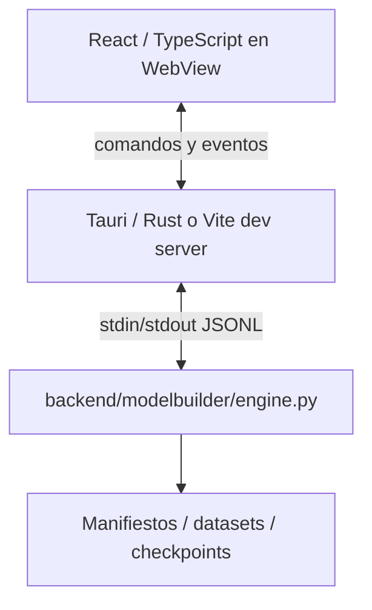

# 06 · Arquitectura técnica y distribución

**Estado actualizado:** scaffold React/Tauri/Python, motor PyTorch y persistencia básica implementados. El transporte real difiere de la propuesta inicial: no hay sidecar Python persistente ni worker separado; cada comando spawnea `backend/modelbuilder/engine.py` y usa `stdin/stdout` con JSON por líneas (Tauri) o HTTP via Vite (modo web de desarrollo). El empaquetado multiplataforma y la distribución siguen pendientes.

## 1. Stack y responsabilidad

| Capa | Tecnología propuesta | Responsabilidad |
| --- | --- | --- |
| UI | React + TypeScript + Vite | Pantallas, navegación, estado de edición y componentes |
| Estilo | CSS con tokens y componentes accesibles reutilizables | Temas, layout, foco, densidad y consistencia |
| Canvas | React Flow (`@xyflow/react`) | Nodos/puertos/aristas, selección y viewport |
| Auto-layout | ELK.js, inicialmente como candidato a validar | Posiciones de grafos con ramas; ejecución fuera del hilo principal si es costosa |
| Gráficas | Apache ECharts | Loss, métricas, dispersión, matrices y zoom |
| Escritorio | Tauri 2 + Rust | Ventana, diálogos, recursos locales y supervisión de procesos |
| Backend | Python + PyTorch | Dominio, datos, compilación del grafo, entrenamiento e inferencia |
| Contratos | JSON Schema + modelos Python y tipos TS generados | Protocolo/versiones/esquemas de bloques y artefactos |
| Persistencia | Manifiestos JSON, logs JSONL, archivos de pesos y datos indexados | Proyectos portátiles, snapshots y recuperación |
| Paquete Python | PyInstaller como primera opción a probar | Runtime local y dependencias, separado de la UI |

ECharts ofrece series, heatmaps y herramientas interactivas de zoom/tooltips; usaremos sólo los componentes necesarios y validaremos su coste en el WebView real. Véase [funcionalidades oficiales](https://echarts.apache.org/en/feature.html). Elegir una biblioteca no sustituye medir accesibilidad ni rendimiento del producto.

No se exige Next.js, SSR, servidor remoto ni cuenta del usuario. Un navegador puede alojar la UI durante desarrollo con un adapter de pruebas, pero la distribución primaria es de escritorio. El backend sigue siendo Python aunque Tauri añada una capa pequeña en Rust.

## 2. Procesos



En **modo Tauri**, Rust ejecuta `python backend/modelbuilder/engine.py` como subproceso por cada comando, escribe el JSON por `stdin`, lee la última línea de `stdout` y devuelve el resultado al frontend mediante IPC. Para entrenamiento, el subproceso se lanza en un hilo aparte y su `stdout` se reenvía como eventos Tauri.

En **modo web de desarrollo**, un plugin de Vite expone tres endpoints HTTP:
- `POST /api/backend` — lanza `engine.py` y devuelve la última línea de `stdout`.
- `POST /api/start-training` — lanza `engine.py` y reenvía cada línea como SSE.
- `GET /api/training-events` — Server-Sent Events con el progreso.

No hay sidecar persistente, handshake, worker separado ni jobs cancelables en la versión actual. Cada llamada al backend crea un proceso Python efímero.

## 3. Transporte

- **Tauri:** JSON por líneas sobre `stdin/stdout` de un subproceso Python efímero. No se abren puertos HTTP.
- **Modo web de desarrollo:** HTTP/1.1 via Vite, con JSON para comandos y Server-Sent Events para progreso de entrenamiento.

Mensajes planos: `{ action, ...payload }`. Respuesta: `{ ok, result }` o `{ ok: false, error: { code, message } }`. Eventos de entrenamiento: `{ type, epoch, train_loss, val_loss, metric, ... }`.

Imágenes y previews circulan como base64 PNG en las respuestas de inferencia y análisis de datos. Los datasets y checkpoints se guardan en disco como tensores `.pt` y se referencian por ruta.

## 4. Envelope y semántica de mensajes

Mensaje de comando actual:

```json
{ "action": "graph.validate", "project_id": "...", "graph": {...}, "dataset": {...} }
```

Respuesta:

```json
{ "ok": true, "result": {...} }
```

o

```json
{ "ok": false, "error": { "code": "validation_failed", "message": "..." } }
```

Evento de entrenamiento:

```json
{ "type": "epoch", "epoch": 3, "train_loss": 0.41, "val_loss": 0.38, "metric": 0.84 }
```

*Diferencias respecto a la propuesta inicial:* no hay `protocol_version`, `request_id`, `kind`, `method`, `expected_revision`, `seq` ni `timestamp` estructurado. El protocolo es plano y suficiente para la funcionalidad actual.

## 5. API implementada

| Acción | Descripción |
| --- | --- |
| `hello` / `system.gpu` | Handshake mínimo y detección de dispositivo. |
| `project.create` / `project.open` / `project.delete` / `project.state.save` | Gestión de proyectos en disco (solo Tauri). |
| `data.catalog` / `data.download` / `data.exists` | Catálogo por tarea, descarga/caché de Hugging Face y verificación física. |
| `data.generate` / `data.import` / `data.pipeline.apply` / `data.analytics` | Compatibilidad histórica, importación y análisis de datasets. |
| `graph.validate` | Validación semántica y dry-run del grafo. |
| `train` | Inicio de entrenamiento; devuelve aceptación y emite eventos. |
| `inference.run` | Predicción desde un checkpoint. |
| `pick_directory` | Diálogo nativo de selección de carpeta (Tauri). |

*Pendientes respecto a la propuesta:* un catálogo general de modelos/bloques, `graph.save`, `graph.dry_run`, `resources.*`, `run.pause/resume/cancel`, `checkpoint.*`, `evaluation.*`, `artifact.*`, idempotencia y versionado de protocolo.

## 6. Dominio actual

El backend es monolítico: `engine.py` enruta acciones a `storage.py`, `data.py`, `models.py` y `training.py`. No existe la separación en `TaskSpec`, `BlockSpec`, `DatasetAdapter`, `TrainingRecipe` ni `InferenceAdapter`.

Para añadir una tarea o familia hay que modificar:
- `backend/modelbuilder/catalog.py` — tareas y compatibilidades.
- `frontend/src/catalog.ts` — catálogo duplicado para la UI.
- `backend/modelbuilder/data.py` — generador/importador y pipeline.
- `backend/modelbuilder/models.py` — bloques y compilación.
- `backend/modelbuilder/training.py` — loss y métrica.
- `backend/modelbuilder/engine.py` — inferencia y rutas de datos.
- `tests/` — pruebas de forward/backward y recorridos.

*Ampliación futura:* unificar catálogos de frontend y backend mediante un contrato JSON Schema y tipos TypeScript generados.

## 7. Persistencia actual

Estructura real generada en `workspace_data/projects/<project-id>/`:

```text
<project-id>/
├── project.json              # nombre, task_id, architecture, timestamps
├── state.json                # estado de la UI (borrador)
├── datasets/<dataset-id>/<revision>/
│   ├── manifest.json
│   └── dataset.pt
├── runs/<run-id>/
│   ├── run.json              # config e hiperparámetros
│   ├── events.jsonl          # métricas por epoch
│   ├── result.json           # resumen final
│   ├── best.pt               # mejores pesos
│   └── last.pt               # últimos pesos
└── latest.json               # puntero a corrida más reciente
```

`state.json` guarda el grafo completo (nodos, edges, propiedades y layout) como un único objeto; no hay revisiones ni separación entre `graph.json` y `layout.json`. Los checkpoints guardan `model_state`, `optimizer_state`, `epoch`, `history` y referencias al grafo/dataset; no incluyen scheduler, AMP ni cursor de datos, por lo que no se soporta reanudación exacta.

*Ampliaciones futuras:* separar grafo semántico de layout, versionar revisiones, publicar checkpoints con hashes y soportar reanudación completa.

## 8. Estado del frontend y rendimiento

Todo el estado vive en `frontend/src/App.tsx` mediante `useState`, `useEffect` y `localStorage` para preferencias de tema/acento. No hay store central ni separación en `stores/`, `features/` ni listas virtualizadas.

Objetivos de rendimiento propuestos en la especificación original (FPS, latencia, memoria, manejo de 100.000 puntos) **no han sido medidos ni reportados** todavía.

*Ampliaciones futuras:* refactorizar a stores por área, memoización por node/run y mediciones de rendimiento reales.

## 9. Distribución

La distribución todavía no está implementada. Solo existen scripts de desarrollo:

- `run-web.sh` — modo web via Vite.
- `run.sh` — `npm run tauri dev`.

Pendientes:

- Empaquetado del runtime Python (PyInstaller u otra opción).
- Configuración de `externalBin` / sidecar en Tauri.
- Builds Linux (AppImage/deb) y Windows (instalador .msi/.exe).
- Matriz de SO/versiones y pruebas de instalación desde cero.
- Licencias de dependencias y assets locales.

Tauri requiere WebKitGTK/GLib en Linux y WebView2 en Windows. Ver [prerrequisitos de Tauri](https://v2.tauri.app/start/prerequisites/).

## 10. Estructura real del código

```text
frontend/src/
  App.tsx            # estado global y pantallas
  bridge.ts          # adaptador Tauri / HTTP
  catalog.ts         # catálogo de tareas y bloques (duplicado con backend)
  types.ts           # tipos TypeScript manuales
  Chart.tsx          # componente de gráficas ECharts
  DataCharts.tsx     # visualizaciones de datos
  DataPipelineEditor.tsx
  ModelNode.tsx
  styles.css, ui-polish.css, inference-layout.css
  main.tsx
src-tauri/src/
  lib.rs             # comandos Rust y spawn de Python
  main.rs
backend/modelbuilder/
  catalog.py         # tareas y compatibilidades
  data.py            # importadores y generadores
  engine.py          # router de acciones
  models.py          # bloques y compilación del grafo
  storage.py         # persistencia de proyectos
  training.py        # entrenamiento
schemas/             # no existe; los tipos están manuales
tests/
  test_engine.py
  test_new_architectures.py
docs/
references/
```

La estructura actual es plana y funcional. La propuesta modular de `features/`, `stores/`, `domain/` y `schemas/` queda como deuda técnica documentada para futuras iteraciones.
